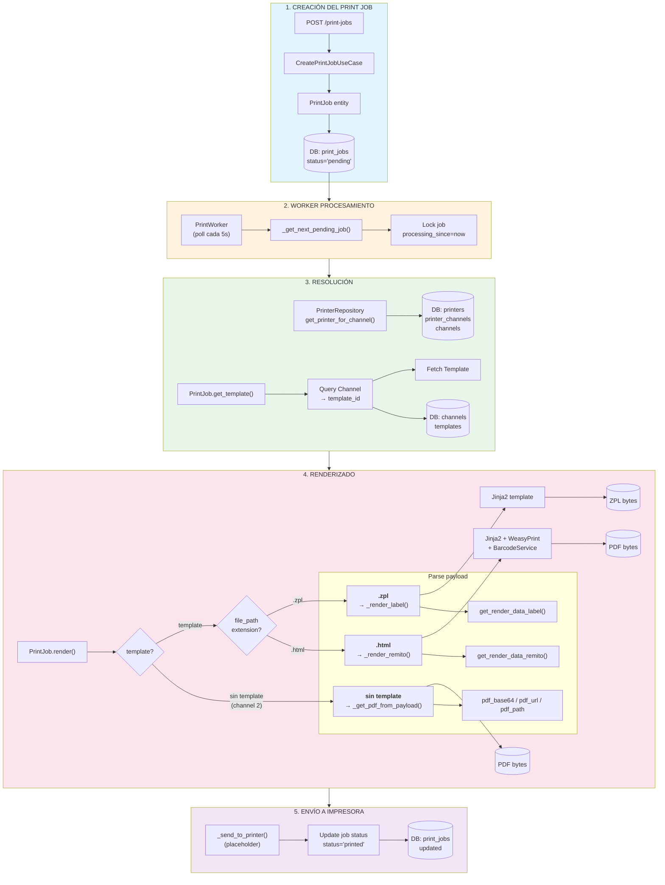

# Print Job Flow

## Flujo Completo de un Print Job



---

## Descripción del Flujo

| Paso | Componente | Descripción |
|------|-----------|-------------|
| **1** | API → UseCase → Entity | Se crea el PrintJob en la DB con status "pending" |
| **2** | Worker poll | El worker hace polling cada 5 segundos buscando jobs pending |
| **3** | Resolución | Se busca en la DB la impresora y el template asociados al channel |
| **4** | Renderizado | Se decide por extensión (.zpl = label, .html = remito/PDF) |
| **5** | Envío | Se envía a la impresora y se actualiza el status |

---

## Entidades Principales

| Entidad | Tabla DB | Relación |
|---------|----------|----------|
| **PrintJob** | `print_jobs` | Datos del trabajo |
| **Channel** | `channels` | Define tipo de documento |
| **Template** | `templates` | Archivo (file_path) a usar |
| **Printer** | `printers` | Impresora física |
| **PrinterChannel** | `printer_channels` | Relación many-to-many |

---

## Decisión de Template

```
print_job.render()
    │
    ├── template = get_template()
    │       │
    │       └── Query: Channel → template_id → Template
    │
    ├── if not template (channel sin template, ej. channel 2):
    │       └── _get_pdf_from_payload() → PDF bytes
    │             (pdf_base64 | pdf_url | pdf_path/ftp_filename)
    │
    ├── elif template.file_path.endswith('.zpl'):
    │       └── _render_label() → ZPL bytes
    │
    └── elif template.file_path.endswith('.html'):
            └── _render_remito() → PDF bytes (via WeasyPrint)
```

### Channel 2: PDF pre-generados

Para channels sin template (ej. channel 2), el payload debe contener una de:

| Campo | Descripción |
|-------|-------------|
| `pdf_base64` | PDF codificado en base64 |
| `pdf_url` | URL HTTP/HTTPS para descargar el PDF |
| `pdf_path` / `ftp_filename` | Ruta local (absoluta o relativa a `/app/infrastructure/data/pdfs`) |

---

## Decisión de Impresora

```
Worker._process_one_job()
    │
    └── printer = printer_repo.get_printer_for_channel(channel)
            │
            └── Join: Printer → PrinterChannel → Channel
                      WHERE channel_number = {channel}
```
